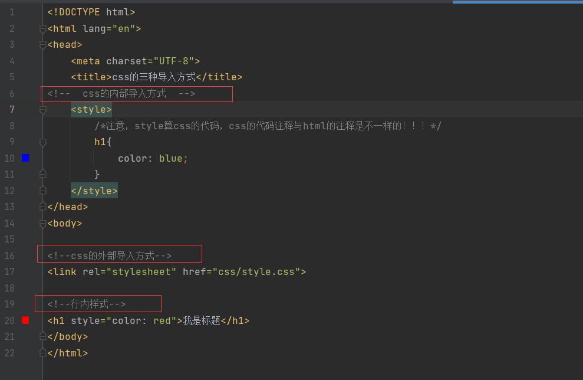
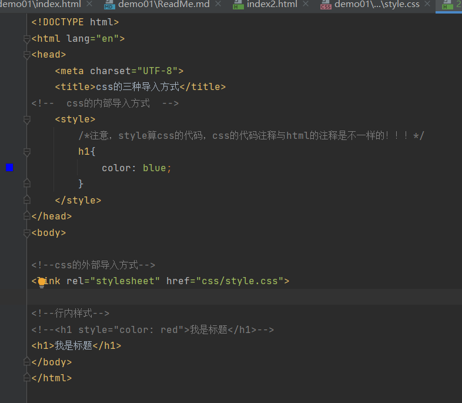
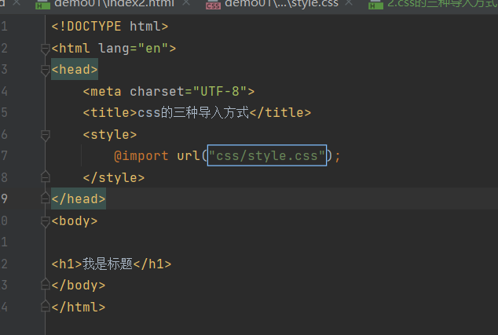
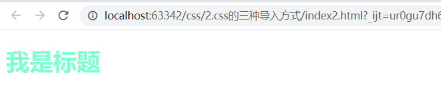

# css的三种导入方式
## 外部导入、内部导入、行内导入
代码如下：



## 哪种方式的优先级高？
最靠近目标代码的是哪种方式，就哪种方式的优先级最高！

上面代码的显示效果如下：


将行内导入方式注释后的代码如下：



显示效果如下：


## 外部导入式也会存在两种写法
### 链接式
```html
<link rel="stylesheet" href="css/style.css">
```
### 导入式
如下图所示：



显示效果如下：



同样可以达到目的，但是import的方式（css2.1的导入方式）有一个弊端！
当打开一个含有元素比较多的网页页面的时候，可能会先打开html的架子，然后再导入css的渲染。
所以经常会看到网页刚打开时比较单一，后续会变得好看。

link的方式就会全部导入后，再进行渲染。