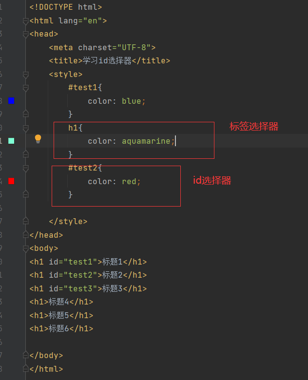

# css的三种基本选择器
除了三种基本选择器，还有高级选择器，这里只说基本选择器。
## 标签选择器
代码如下：

显示效果如下：

## 类 选择器
在css代码中，以“.class”来设置表现，html代码如下：

css代码如下：

显示效果如下：

可见，类加载器可以在不同标签中设置共同样式，只要他们的类一致即可。

## id选择器
在css代码中，以“#id”来进行选择。
note：id全局唯一！！！两个相同的id会报错！如下：

id选择器示例代码如下：

显示效果如下：

## 三种基本选择器有什么优先级？
id选择器>class选择器>标签选择器

代码验证如下：

如果是就近原则的话，那么标题1应该选择绿色，但是实际却是蓝色！

