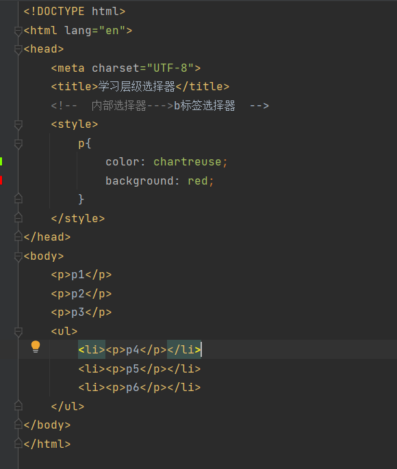
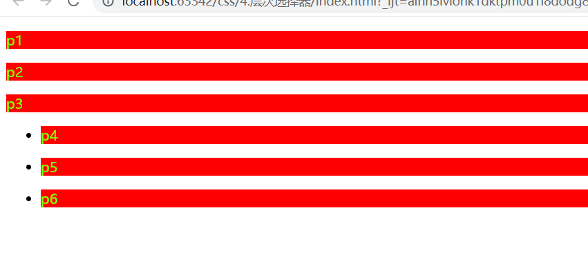
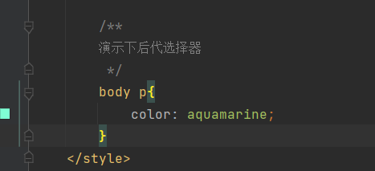
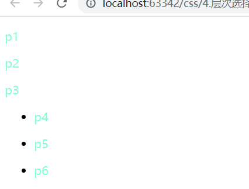
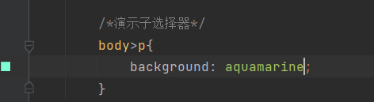
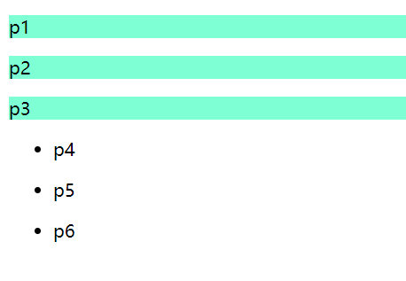
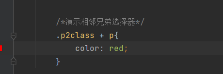
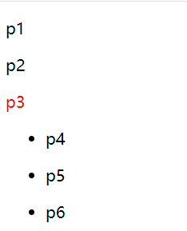
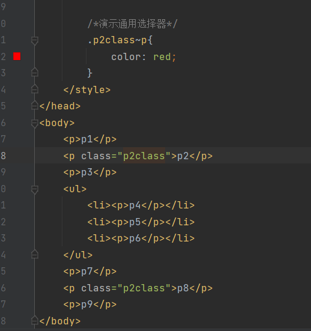
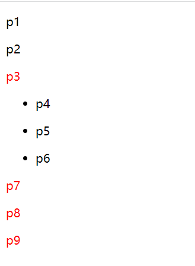

# 层次选择器
想要达到如下的层级布局：


举例标签选择器，代码如下：



显示效果如下：



## 后代选择器
在某个元素的后面  祖爷爷、爷爷、爸爸、你
代码演示如下：



语法：
```css
标签 标签{
}
```

显示效果如下：



## 子选择器
只会选择一个直接后代来进行渲染，举例如下：



语法：
```css
标签>直接子标签{
    
}
```
显示效果如下：



## 相邻兄弟选择器（向下选择兄弟）
选择一个**向下的**兄弟来进行渲染！
代码举例如下：



语法：
```css
.class + 标签{
    
}
```
显示效果如下：



## 通用选择器
向下选择所有的兄弟来进行渲染，代码举例如下



语法：
```css
.class~标签
```

显示效果如下：



可见：只要是属于p2class后面的p标签（必须是同级！），都会显示红色。