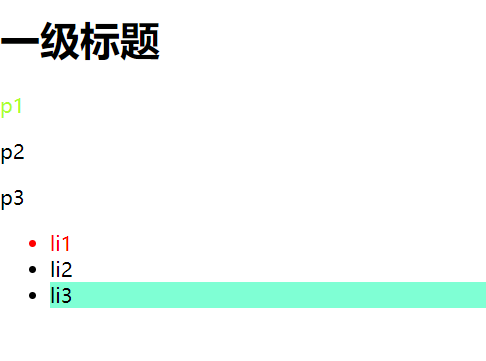

# 结构伪类选择器
将这个结构时，我们先不使用class和id选择器
## 怎么选中ul标签的第一个子标签
代码如下：

演示效果如下：

## 怎么选中ul标签的最后一个标签？
代码如下：

显示效果如下：

## 怎么选中p标签的第n个元素呢？
可以用p:nth-child(n)来实现。
语法解释：选中当前元素的父级元素，选中父级元素的第n个元素，并且选中的元素要是当前标签元素才生效。

示例1：

显示效果如下：

可知，当前p:nth-child(1)并没有生效，因为p标签的父级元素是body标签，然后body标签的第一个元素
是h1标签，并不是当前的p标签，所以不生效！

示例2：

显示效果如下：

可以看到当前p:nth-child(2)生效了。因为p标签的父级元素是body标签，然后body标签的第二个元素
是p标签，符合当前指定的p标签，所以生效！

## 是否可以直接指定某种类型的标签
可以利用p:nth-of-type(n)
表示从当前标签类型的父级元素开始，只计算当前标签类型的第n个。
示例如下：

显示效果如下：

直接针对第一个p元素生效！