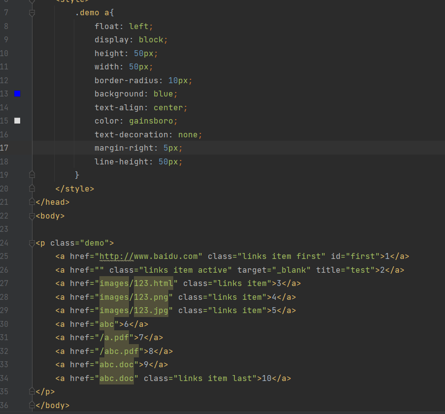
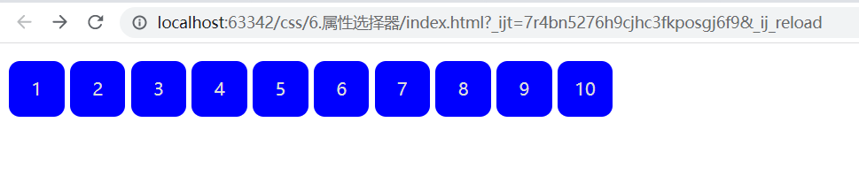
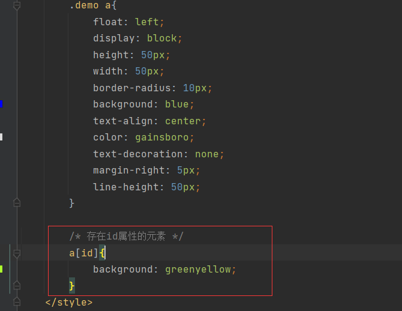
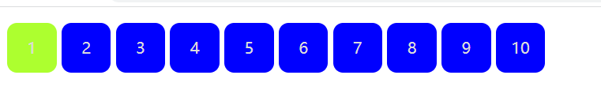
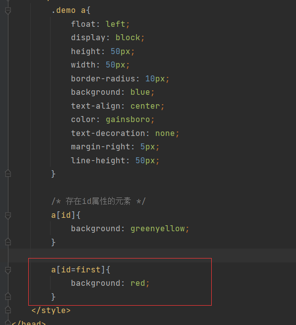
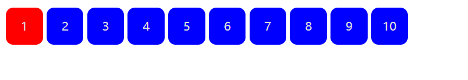
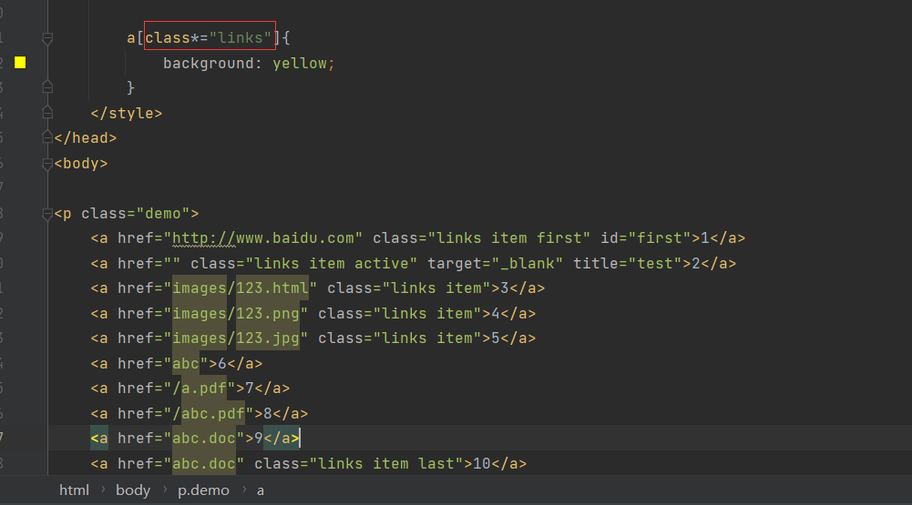
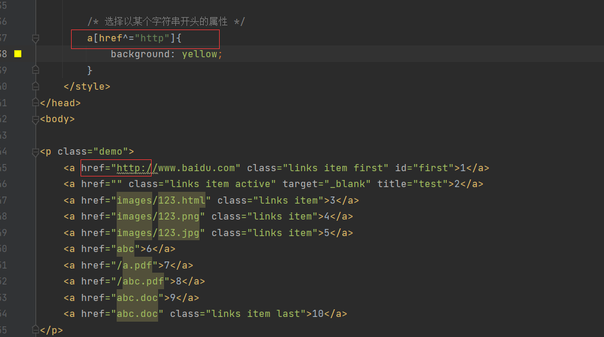
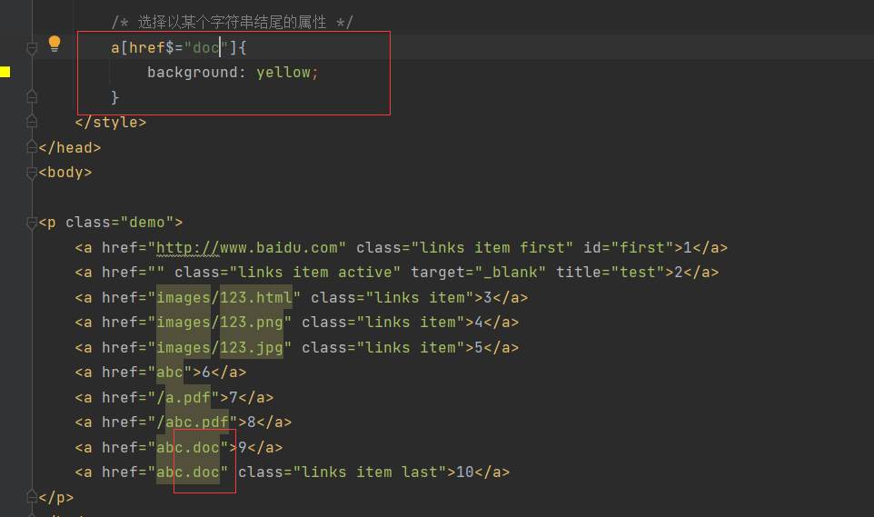

# 属性选择器
## 初始代码如下：

效果如下：

## 属性选择举例
### 选择存在id属性的元素
代码如下：

效果如下：

### 选择id为first的元素
代码如下：

效果如下：

可见，后面的选择会覆盖前面的选择！！！

### 选择包含某个元素
代码如下：

效果如下：

a[class*="links"]中表示class中包含links的属性！！！

### 以某个字符串开头的属性
代码如下：

效果如下：

a[href^="http"]中表示href属性中以http开头的属性！！！

### 以某个字符串结尾的属性
代码如下：

效果如下：

a[href$="doc"]中表示href属性中以doc结尾的属性！！！