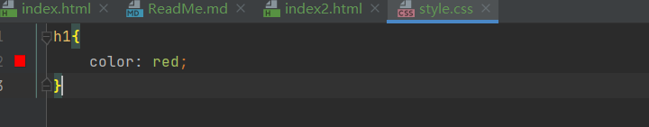

# 初始CSS
## 什么是CSS

英文全称为cascading style sheet，层叠样式表

css:表现（美化网页）

字体、颜色、边距、宽度、高度、背景图片、网页定位、网页浮动...

## 第一个css代码（html和css共存在一个文件）
* index.html文件里既有html的代码，也有css的代码！
* 在html文件里直接写css的代码是不推荐的，要提倡html和css分离！
这种写法就是很不规范的。

代码如下：

效果如下：

再来看看网页按了F12后的network代码，如下：

左侧是html代码，右侧是css代码！

## css和html分离的写法
代码如下：

显示效果如下：

可以看到右侧显示了style.class文件名

## CSS的优势
1、内容（html）和表现（css）分离；
2、网页结构表现统一，可以实现复用（表现可能会有公共部分，可以提取出来供引用）；
3、样式十分的丰富；
4、建议使用独立于html的css文件。

